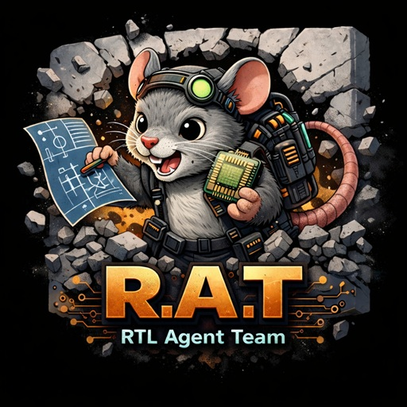

> **한국어 문서**: [README_kr.md](./README_kr.md)

# RTL Agent Team

> A Claude Code plugin for automated RTL design and verification.
> 94 specialized AI agents + 94 skills automate the 6-Phase pipeline:
> Research → Architecture → μArch → RTL → Verify → Design Note.

A Claude Code plugin for automated RTL design and verification.

Automates the 6-Phase design pipeline (Research → Architecture → μArch → RTL → Verify → Design Note) with 94 specialized AI agents + 94 skills + 12 reference documents.



## Marketplace

This repository serves as the **RTL Agent Marketplace**, providing hardware design plugins.

| Plugin | Description | Version |
|--------|-------------|---------|
| **rtl-agent-team** | 94-agent RTL design pipeline (Research → Architecture → μArch → RTL → Verify → Design Note) | 0.9.2 |
| **systemverilog-lsp** | SystemVerilog/Verilog LSP (slang-server based — diagnostics, hover, go-to-definition, etc.) | 1.1.1 |

Additional plugins (domain knowledge packages, MCP servers, specialized skills, etc.) will be added to the Marketplace over time.

## Quick Start

The workflow has **three distinct stages**, each with a different scope and frequency:

| Stage | Scope | Frequency | Commands |
|-------|-------|-----------|----------|
| **A. Machine Setup** | Per machine (global) | Once per machine | `/plugin install` + `/rtl-agent-team:rat-setup` |
| **B. Project Init** | Per project directory | Once per project | `/rtl-agent-team:rat-init-project` |
| **C. Design Work** | Inside project | Recurring | `/rtl-agent-team:rat-auto-design`, phase/sub-skills |

Run each stage from its appropriate working directory: Stage A runs anywhere; Stages B and C should run from **inside** the target project directory (artifacts like `docs/phase-*/`, `rtl/`, `.rat/state/` are written relative to CWD).

### Stage A — Machine Setup (one-time, per machine)

Installs the plugin, audits the EDA toolchain interactively, and optionally deploys global coding conventions.

```bash
# A1. Register the Marketplace (one-time)
/plugin marketplace add babyworm/rtl-agent-team

# A2. Install plugins (one-time)
/plugin install rtl-agent-team
/plugin install systemverilog-lsp   # (optional) SV LSP

# A3. EDA toolchain audit (interactive interview — all steps are opt-in)
#     - Q1 Required tools: python3, g++, make, verilator, cocotb, systemc
#            + lint (verible AND/OR slang — at least one)
#            + CDC (svlens OR sg_shell OR vc_cdc OR questa_cdc — at least one)
#            — prompt to install missing ones (local/global/docker/skip)
#     - Q2 Recommended/optional tools — user picks which to install:
#            jq, yosys + sby, slang-server, iverilog, gtkwave
#     - Q2b Commercial tool scan (vcs, xrun, dc_shell, sg_shell, vc_cdc, ...)
#            — scan + collect env_source; not an install
#     - Q2c Liberty file path for synthesis (optional)
#     - Q3 Optional global deployment (yes/no) — deploys:
#            ~/.claude/rules/rtl-coding-conventions.md
#            ~/.claude/rules/rtl-verification-gate.md
#            ~/.claude/CLAUDE.md diagram rule block (if tag missing)
/rtl-agent-team:rat-setup
```

> If `systemverilog-lsp` is installed but `slang-server` is missing, the sub-plugin checks on `SessionStart` and prompts for `local` (`~/.local/bin`, recommended), `global`, or `skip`.

### Stage B — Project Initialization (one-time, per project)

Scaffolds project directory structure, deploys per-project rules and guides, auto-installs EDA wrapper scripts. Run from inside the project directory — non-destructive, so existing projects are safe (files are only created if missing).

```bash
# B1. cd into your project directory
cd ~/work/my-rtl-project

# B2. Initialize project structure (run inside project)
#     - Creates docs/, rtl/, sim/, refc/, lint/, syn/, formal/, reviews/
#     - Deploys .claude/rules/ (coding conventions, verification gate)
#     - Deploys subdirectory CLAUDE.md (phase-specific guides)
#     - Auto-installs run_sim.sh, run_lint.sh, run_syn.sh, run_cdc.sh
#     - Non-destructive: never overwrites existing files
/rtl-agent-team:rat-init-project
```

### Stage C — Design Work (recurring, inside project)

Execute RTL design and verification pipeline. Run from inside an initialized project — artifacts are created relative to CWD, so an uninitialized directory will not have the expected structure.

```bash
# C1. Full automation (6-Phase pipeline)
/rtl-agent-team:rat-auto-design
# Example natural-language usage:
#   /rtl-agent-team:rat-auto-design "Design an H.264 TQ subsystem"
#   /rtl-agent-team:rat-auto-design "implement VDC-M 1.2 encoder using reference C
#     model in ../vdc-m/refc. Target 4K 60fps at 500MHz, margin 40% under TSMC 28nm"

# C2. OR split pipeline (for human review between stages)
/rtl-agent-team:rat-dse               # Phase 1→2: DSE (algorithm + architecture)
/rtl-agent-team:rat-p1p3-spec-uarch   # Phase 1→3: Spec → μArch design docs
/rtl-agent-team:rat-p4p5-impl-verify  # Phase 4→5: RTL implementation + verification

# C3. OR individual phase/sub-phase skills (see Usage section below)
```

---

## Installation (Stage A alternatives)

The [Quick Start](#quick-start) Stage A already covers plugin installation. The
alternatives below are for users who prefer CLI or development symlinks. After
installing the plugin, still run `/rtl-agent-team:rat-setup` once to audit the EDA
toolchain.

### Install from Claude Code chat (recommended)

```
/plugin marketplace add babyworm/rtl-agent-team
/plugin install rtl-agent-team
```

Verify installation: `/plugin`

### Install from CLI

```bash
claude plugin marketplace add babyworm/rtl-agent-team
claude plugin install rtl-agent-team
```

### Local symlink for development

When developing with direct access to the plugin source:

```bash
git clone https://github.com/babyworm/rtl-agent-team.git
ln -s "$(pwd)/rtl-agent-team" ~/.claude/plugins/local/rtl-agent-team
```

## Usage (Stage C — in-project design work)

This section assumes **Stage A (machine setup) and Stage B (project init) are
already complete**. All commands in this section run from **inside an initialized
project directory**. See [Quick Start](#quick-start) for the full stage map.

### Routing contract

- Route user intent to **Action Skills first** (for example, `/rtl-agent-team:rat-auto-design`, `/rtl-agent-team:rtl-p5-verify`).
- Orchestrator agents are internal execution units and are spawned by Action Skills via `Task(...)`.
- Policy skills are loaded by orchestrators via `skills: [*-policy]`.
- `rtl-orchestrate` is an internal routing reference skill (`user-invocable: false`), not a user slash command.

### Full automation

```
/rtl-agent-team:rat-auto-design
```

Runs the entire 6-Phase pipeline automatically. You can also use natural language, e.g., "Design an H.264 TQ subsystem".

### Autopilot escalation ladder

`rat-auto-design` gates use a per-gate retry ladder:
- `1..N`: primary strategy
- `N+1..2N`: fallback strategy (scope split + agent composition switch)
- `2N+1`: last-chance alternative (one automatic attempt)
- after last-chance fail: stop and ask user guidance

Dynamic fallback guidance is injected through state (`orchestration_control.dynamic_prompt_text`) and surfaced by Stop hooks.

### Pipeline composition (split execution)

```
/rtl-agent-team:rat-dse              # Phase 1→2: Deep algorithm + architecture exploration (DSE)
/rtl-agent-team:codec-rd-eval        # BD-PSNR/BD-rate evaluation for algorithm comparison
/rtl-agent-team:codec-conformance-eval  # Decoder conformance evaluation (JVET/JCTVC/3rd party)
/rtl-agent-team:rat-p1p3-spec-uarch    # Phase 1→3: Spec → μArch design documents
/rtl-agent-team:rat-p4p5-impl-verify  # Phase 4→5: μArch → RTL implementation + verification
```

Split the pipeline for human review between design and implementation:
- `rat-dse`: Deep Design Space Exploration — compare multiple algorithms and architecture candidates with quantitative trade-offs. Can also transform an existing functional C model into an architectural reference model. Stops at Phase 2 for review.
- `rat-p1p3-spec-uarch`: Standard Phase 1→3 — produce design documents through μArch. Stops for review before RTL.
- `rat-p4p5-impl-verify`: Phase 4→5 — implement RTL and run full verification from approved μArch documents.

### Resume interrupted pipeline

If `rat-auto-design` is interrupted, progress is saved automatically. Re-run the same command to resume from the last incomplete step — completed phases are skipped.

> **Note:** Project initialization (`rat-init-project`) and EDA tool setup
> (`rat-setup`) belong to Stages A/B and are described in [Quick Start](#quick-start).

### Individual skills

```
/rtl-agent-team:rtl-lint-check           # RTL lint check
/rtl-agent-team:rtl-p5s-func-verify      # cocotb functional verification
/rtl-agent-team:rtl-synth-check          # Yosys synthesis
/rtl-agent-team:rtl-p5s-sva-check        # SVA formal verification
/rtl-agent-team:p2-arch-design           # Architecture design
/rtl-agent-team:domain-consult           # Domain expert consultation
```

### Skill categories (94 skills)

| Category | Count | Description |
|----------|-------|-------------|
| **Action Entry Points** | 54 | User-invocable slash commands: Pipeline (`rat-auto-design`, `rat-setup`, `rat-init-project`, `rat-dse`, `rat-ultraloop`, ...), Phase 1-3 spec/arch/uArch, Phase 4 RTL + bugfix + refactor + unit test + block-parallel, Phase 5 functional/formal/CDC/protocol/perf/coverage/UVM/integration, Phase 6-7 review + exploration, and utility skills (lint, synth, ipxact, bug-repro, domain-consult, codec eval, ref-model, bfm-develop, arch-review, ...) |
| **Policy** | 31 | Rules/criteria referenced by agents (`*-policy`, non-user-invocable) |
| **Convention** | 4 | Auto-applied by file extension: SystemVerilog, SVA, UVM, SystemC |
| **Tool Profile** | 4 | Simulator/linter/synthesizer/CDC tool configurations |
| **Internal** | 1 | Routing SSOT (`rtl-orchestrate`) |
| **Total** | **94** | |

Assets (Templates, Scripts, References, Examples) are distributed across the 94 skills — see each skill directory for its bundled assets.

## Project Artifact Structure

Each Phase's design artifacts (`docs/`) serve as inputs to the next Phase, forming a pipeline.
Spec compliance verdicts (`reviews/`) are managed separately.

```
docs/phase-1-research/ ──→ docs/phase-2-architecture/ ──→ docs/phase-3-uarch/
        ──→ docs/phase-4-rtl/ ──→ docs/phase-5-verify/ ──→ reviews/phase-6-review/
        ──→ docs/phase-7-exploration/ (optional, free exploration)
```

| Directory | Role | Notes |
|-----------|------|-------|
| `docs/phase-N-*/` | Phase-specific design documents (guide pipeline) | Phase N → Phase N+1 input |
| `reviews/phase-N-*/` | Spec compliance verdict (PASS/FAIL) | Verdict only, no data |
| `rtl/` | RTL SystemVerilog source code | Phase 4 code artifact |
| `sim/`, `formal/` | Testbenches | Phase 4-5 code artifacts |
| `refc/` | C golden reference model (DPI-C compatible) | Phase 2 code artifact |
| `docs/decisions/` | Architecture Decision Records (ADR) | Phase 2-3 decision rationale |
| `docs/lessons-learned.md` | Lessons learned from feedback loops | Accumulated across phases |

## Plugin Structure

```
rtl-agent-team/
├── .claude-plugin/
│   ├── plugin.json             # Plugin manifest (auto-discovery)
│   └── marketplace.json        # Marketplace definition
├── CLAUDE.md                   # 6-Phase pipeline rules
├── agents/                     # 94 agents (design/verification/review/EDA/domain/orchestrators)
├── scripts/
│   └── run_sim.sh              # Simulator-agnostic compile+run wrapper (replay-enabled)
├── skills/                     # 94 skills (SKILL.md + templates/ + examples/)
│   ├── rtl-orchestrate/        # Internal routing SSOT + SessionStart hook export source
│   ├── rat-init-project/
│   │   ├── scripts/
│   │   │   └── install_project_templates.sh  # Hook-driven template auto-installer
│   │   └── templates/          # run_lint.sh, run_syn.sh, run_cdc.sh + other templates
│   ├── rtl-p5s-func-verify/
│   │   ├── scripts/            # run_regression.sh, merge_coverage.sh
│   │       └── run_regression.sh  # Multi-seed regression runner (local-first)
│   ├── systemverilog/          # RTL coding conventions (lowRISC + overrides)
│   ├── systemverilog-assertion/ # SVA coding conventions (bind, SymbiYosys)
│   ├── uvm/                    # UVM coding conventions (factory, TLM, coverage)
│   ├── systemc/                # SystemC/TLM-2.0 (AT non-blocking, AMBA-PV)
│   └── {skill}/references/     # 12 reference documents (distributed per skill)
│       ├── coding-style-guide.md   # SV naming conventions (in systemverilog/)
│       ├── axi-protocol-rules.md   # AXI4 per-channel SVA templates (in rtl-p5s-protocol-verify/)
│       ├── sva-patterns.md         # SVA temporal operators + pattern library (in rtl-p5s-sva-check/)
│       ├── cocotb-ecosystem.md     # cocotb API, cocotb-bus, coverage (in rtl-p5s-func-verify/)
│       └── ...                     # + 9 more (CDC, UVM, Yosys, SDC, etc.)
├── hooks/                      # Event-driven enforcement (15 hook scripts / 16 registrations)
│   ├── rtl-skill-activation.sh # PreToolUse:Skill — setup check + template bootstrap
│   └── ...                     # + 13 more (routing inject, verify gate, cascade, etc.)
├── docker/                     # EDA tool Docker image
│   └── Dockerfile              # Open-source EDA full bundle
└── domain-packages/            # Domain knowledge packages
    ├── video-codec/            # H.264/H.265 knowledge, conformance data
    └── video-processing/       # Color conversion, denoise, HDR/ISP (3 agents)
```

### Routing sync for contributors

When modifying routing/delegation docs:

```bash
sh scripts/sync_orchestrator_inject.sh
python -m pytest -q tests/unit/test_agent_skill_structure.py tests/unit/test_hooks.py tests/unit/test_plugin_runtime_contract.py
```

## Agent Team

### Agent Composition (94 agents, all Opus)

| Category | Count | Key Agents |
|----------|-------|------------|
| Design | 8 | spec-analyst, arch-designer, rtl-architect, uarch-designer, rtl-coder, rtl-critic, rtl-planner, rtl-explorer |
| Verification | 7 | testbench-dev, func-verifier, perf-verifier, sva-extractor, protocol-checker, coverage-analyst, waveform-analyzer |
| Specialized Review | 14 | codex-cross-reviewer, cdc-reviewer, protocol-reviewer, formal-reviewer, power-analyzer, synthesis-reviewer, uvm-reviewer, cocotb-reviewer, ref-model-reviewer, requirement-tracer, regression-analyzer, equivalence-checker, integration-verifier, security-reviewer |
| Phase 6 Design Note | 4 | code-quality-reviewer, design-quality-reviewer, design-note-writer, improvement-analyst |
| EDA/Synthesis | 8 | eda-runner, synthesis-reporter, lint-checker, constraint-writer, timing-advisor, cdc-checker, clock-architect, dft-designer |
| Infrastructure | 3 | ipxact-generator, bfm-dev, ref-model-dev |
| Domain Experts | 13 | domain-expert, vcodec-chief-standard-expert, vcodec-syntax-entropy-expert, vcodec-intra-pred-expert, vcodec-me-expert, vcodec-mc-expert, vcodec-transform-quant-expert, vcodec-filter-recon-expert, vcodec-architecture-expert, video-processing-expert, vproc-color-format-expert, vproc-denoise-expert, vproc-image-processing-expert |
| Orchestrators | 32 | autopilot-orchestrator, p1-research-orchestrator, p2-arch-orchestrator, p3-uarch-orchestrator, p4-implement-orchestrator, p5-verify-orchestrator, p6-review-orchestrator, and 25 more (team/sub-phase variants) |

Model policy:
- Use `opus` for reasoning-heavy analysis, architecture decisions, and debugging.
- Use `sonnet` only for documentation generation or tool-result summarization/formatting.

### 6-Phase Pipeline (+Phase 7 Optional Exploration)

| Phase | Name | Key Agents | docs/ Artifacts | reviews/ Verdict |
|-------|------|------------|-----------------|------------------|
| 1 | Research | spec-analyst | requirements.json, io_definition.json, domain-analysis.md | research-review.md |
| 2 | Architecture + Ref Model | arch-designer, ref-model-dev | architecture.md | architecture-review.md |
| 3 | μArch + BFM | uarch-designer, bfm-dev | {module}.md (per module) | uarch-review.md |
| 4 | RTL + Unit Test | rtl-coder, lint-checker | module-descriptions.md, unit-test-design.md, Stream B artifacts | design-review.md |
| 5 | Verify | func-verifier, sva-extractor | unit-test-report.md, lint-report.md, etc. | final-compliance.md, e2e-traceability.md |
| 6 | Design Note | code-quality-reviewer, design-note-writer | - | code-review.md, design-review.md, design-note.md, improvements.md |
| 7 | Exploration (optional) | improvement-analyst | exploration-notes.md | exploration-review.md |

> **Additional pipeline artifacts:** Each Phase (1-5) generates `phase-N-summary.md` for downstream context compression. Phase 4 Stream B produces SVA/CDC/TB skeletons in parallel with RTL coding. Phase 2-3 record Architecture Decision Records in `docs/decisions/`.

### Coding Convention Skills

| Skill | Target | Key Content |
|-------|--------|-------------|
| `systemverilog` | `.sv`, `.svh`, `.v`, `.vh` | lowRISC + project overrides, Power, FPGA, Pipelining |
| `systemverilog-assertion` | SVA, bind files | assume/assert/cover, SymbiYosys, bind patterns |
| `uvm` | UVM testbench | factory, TLM ports, coverage, phase callback |
| `systemc` | `.cpp`, `.h` (SystemC) | TLM-2.0 AT non-blocking, AMBA-PV (AXI/AHB/APB), Memory Manager, PEQ |

### 3-Layer Documentation Structure (Progressive Disclosure)

| Layer | Location | Role |
|-------|----------|------|
| Core rules | `skills/*/SKILL.md` → `<Steps>` | Mandatory rules that agents always read |
| Situational guides | `skills/*/SKILL.md` → `<Advanced>` | Referenced only in specific optimization/scenarios |
| Detailed references | `skills/*/references/*.md` | Command references, pattern libraries, protocol details |

## EDA Tools

The `eda-runner` agent executes local EDA CLI tools directly via Bash.

| Tool | Purpose | Required |
|------|---------|----------|
| verilator | Simulation + Lint | Required |
| verible | Style Lint + Formatting | Required (at least one of verible/slang) |
| slang | IEEE 1800 semantic Lint | Required (at least one of verible/slang) |
| svlens | CDC + structural analysis (conn/metrics) | Required (or one of sg_shell/vc_cdc/questa_cdc) |
| slang-server | SV Language Server (LSP) | Recommended |
| cocotb (Python) | Functional verification | Required |
| python3 | cocotb runtime | Required |
| g++ | Reference model build | Required |
| make | Build system | Required |
| systemc | SystemC/TLM-2.0 (ref model, BFM) | Required |
| iverilog | Fallback simulator | Optional (if verilator installed) |
| yosys | Synthesis (Phase 5B+) | Optional |
| sby (SymbiYosys) | Formal verification | Optional |
| gtkwave | Waveform viewer | Optional |
| vcs / xrun / questa | Commercial simulators | Optional |
| spyglass (sg_shell) | Commercial lint + CDC | Optional |
| dc_shell (Design Compiler) | Commercial synthesis | Optional |
| vc_cdc / questa_cdc | Commercial CDC analysis | Optional (satisfies CDC requirement) |

Use `/rtl-agent-team:rat-setup` to check tool installation status and configure commercial tools interactively.

For detailed commercial tool setup (env_source, technology library, vendor examples), see the **[EDA Setup Guide](plugin_docs/eda-setup-guide.md)**.

### EDA Wrapper Scripts

All EDA operations use replayable wrapper scripts that generate timestamped + `_latest.sh` replay scripts for reproducibility.

| Script | Location | Supports |
|--------|----------|----------|
| `run_sim.sh` | `scripts/` | iverilog, verilator, vcs, xrun (xcelium), questa |
| `run_lint.sh` | `lint/scripts/` | verilator, verible, slang, spyglass |
| `run_syn.sh` | `syn/scripts/` | yosys, dc_shell (Design Compiler) |
| `run_cdc.sh` | `lint/scripts/` | structural (heuristic), svlens, spyglass, vc_cdc, questa_cdc |
| `run_regression.sh` | `sim/regression/` | Multi-seed cocotb regression (local-first, AWS opt-in) |

Scripts are auto-installed by the `rat-init-project` hook bootstrap. Each run produces replay scripts under `{outdir}/replay/` — re-run the exact EDA command with `bash replay/run_*_latest.sh`.

Regression runner defaults to `--mode local` with `max(1, nproc-2)` parallel jobs. AWS Batch requires explicit opt-in (`RTL_ALLOW_AWS=1` + `RTL_AWS_BATCH_RUNNER`).

### Docker EDA Image (Recommended)

If installing EDA tools individually is cumbersome, you can build a Docker image containing all tools:

```bash
# Build image (one-time)
docker build -t rtl-eda-tools docker/

# Run with project mounted
docker run -it --rm -v $(pwd):/workspace -w /workspace rtl-eda-tools

# Build with specific versions
docker build -t rtl-eda-tools \
  --build-arg VERILATOR_VERSION=5.024 \
  --build-arg SLANG_VERSION=v6.0 \
  --build-arg SYSTEMC_VERSION=3.0.2 \
  docker/
```

Included tools: Verilator, Verible, Yosys, Icarus Verilog, slang, svlens (CDC + structural analysis), slang-server (SV LSP), SystemC/TLM-2.0, SymbiYosys (+ boolector, z3), GTKWave, cocotb, cocotb-bus, cocotbext-axi, gcc/g++.

You can also build from Claude Code: "Build the EDA Docker image" or run `/rtl-agent-team:rat-setup` and select the Docker option.

## Marketplace Structure

This repository operates as a **marketplace**, not a single plugin.

```
rtl-agent-team/                          # Marketplace root
├── .claude-plugin/
│   ├── plugin.json                      # rtl-agent-team plugin manifest
│   └── marketplace.json                 # Marketplace definition (plugin list)
├── agents/                              # rtl-agent-team agents (94)
├── skills/                              # rtl-agent-team skills (93, with 12 reference docs)
├── plugins/
│   └── systemverilog-lsp/               # SV LSP plugin (standalone)
└── domain-packages/                     # Domain knowledge packages
    ├── video-codec/                     # H.264/H.265 codec knowledge
    └── video-processing/                # Color, denoise, HDR/ISP
```

To add a new plugin to the Marketplace, add an entry to the `plugins` array in `.claude-plugin/marketplace.json`:
- Same repo: `"source": "./plugins/new-plugin"`
- External repo: `"source": {"source": "github", "repo": "owner/repo"}`

## Development

This plugin is declarative-first (`.md` + `.json` skill definitions with helper `.py`/`.sh` scripts) — no build step required.

```bash
git clone https://github.com/babyworm/rtl-agent-team.git
ln -s "$(pwd)/rtl-agent-team" ~/.claude/plugins/local/rtl-agent-team
```

## License

MIT
