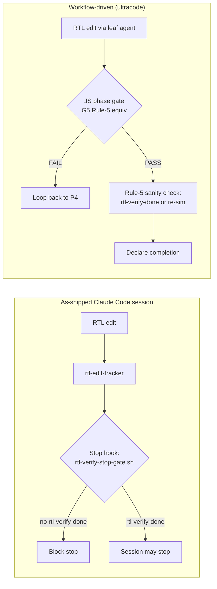

# Workflow-Driver Gate Model — Rule-5 Supersession Semantics

- Date: 2026-07-17
- Status: Documented decision (no code change — documentation only)
- Origin: `plugin_docs/specs/workflow-ultracode-compat.md` proposed-only item 4
- Validation: 2026-07-15 huffman_vld flow-test —
  `plugin_docs/plans/2026-07-15-vld-flowtest-design.md`

## 1. Context

Pipeline Rule 5 ("no completion after RTL modification without functional
verification") is the plugin's only **hard** gate. In as-shipped Claude Code
sessions it is enforced by the Stop hook `hooks/rtl-verify-stop-gate.sh`, which
blocks session stop until `.rat/state/rtl-verify-done` (or `rtl-verify-waiver`)
exists.

When an external **Workflow** driver (the ultracode "orchestrator-as-workflow"
model) owns phase/gate control flow in JS and calls **leaf specialist agents**
directly, the Stop hook is not the operative enforcement point: the JS driver
decides when a phase is complete, and its per-phase gate functions run before
any completion is declared.

## 2. Decision

| Aspect | Decision |
|--------|----------|
| Rule-5 enforcement under a Workflow driver | **Functionally superseded** by JS gate logic (e.g., G5: bitexact vector comparison + randomized regression PASS + formal safety proof) |
| Semantic equivalence | The JS gate and the Stop hook enforce the same invariant — "RTL change ⇒ functional sim must pass before completion". Validated in the 2026-07-15 huffman_vld flow-test: all phases PASS, independently verified, and a separate Rule-5 hook sanity check confirmed native Stop-gate behavior (blocks without `rtl-verify-done`, passes with it) |
| `rtl-verify-stop-gate.sh` | **MUST NOT be modified.** As-shipped Claude Code sessions (no Workflow driver) still depend on the Stop hook as the sole hard enforcement of Rule 5. Supersession is a runtime property of the Workflow context, not a change to the plugin |
| Workflow-side sanity check | A Workflow driver **SHOULD retain a Rule-5 sanity check**: before declaring pipeline completion, verify `.rat/state/rtl-verify-done` exists (and postdates the last RTL edit), or rerun the functional simulation. This guards against a JS gate bug silently passing an unverified RTL change |

## 3. Preconditions (Workflow driver contract)

These are prerequisites for the supersession to be sound; without them the
driver operates on the wrong project root and neither gate model is trustworthy
(see `workflow-ultracode-compat.md` for full derivation):

1. **`RAT_PROJECT_ROOT`** — set to an **absolute path** to the RAT-initialized
   project root (must contain the `.rat`/`.rtl-agent-team` marker). This
   redirects all hooks (`rat-dir-util.sh` sourcing hooks + the standalone
   SessionStart injector) so gate/state/audit files land in the real project.
2. **Leaf-specialist-agent targeting** — drive leaf specialist agents directly,
   not multi-level orchestrators, so nested `Task()` spawns cannot silently
   drop the path contract.
3. **Absolute-path `PROJECT_ROOT` prompt contract** — inject an explicit
   `PROJECT_ROOT=<abs>` line into each leaf-agent prompt (and/or set the leaf
   agent's CWD to the project root). The env override redirects hooks only;
   agent Read/Write/Edit I/O still resolves bare relative paths against the
   subagent process CWD.

## 4. Non-goals

- No change to `hooks/rtl-verify-stop-gate.sh` or any other Stop hook.
- No plugin-side detection of "Workflow-driven mode" — the supersession is
  entirely a property of the external driver, and the Stop hook remains active
  (and harmless) in the leader session if one exists.
- No relaxation of Rule 5 itself: both gate models enforce the identical
  invariant; only the enforcement point moves.
