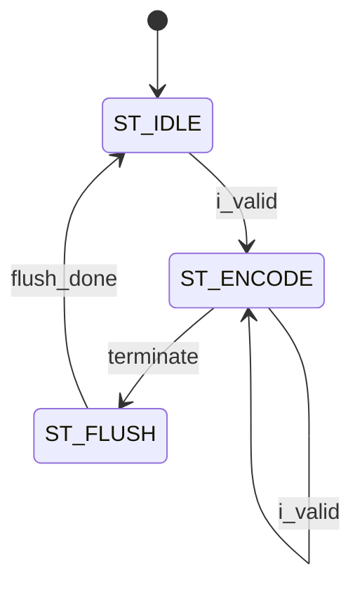

# cabac_encoder_excerpt

> Auto-generated from `tests/fixtures/rtl-document/cabac_encoder_excerpt.sv`. Replace every `<!-- LLM_FILL: ... -->` marker.

## Overview

H.264/H.265 CABAC encoder front-end: accepts bin-by-bin input with context index and produces packed 8-bit byte output via range coding.

## Parameters

| Parameter | Type | Default | Description |
|-----------|------|---------|-------------|
| CTX_WIDTH | int | 7 | Bit width of the context index, supporting up to 128 context models. |

## Ports

| Port Name | Direction | Width | Clock Domain | Kind | Description |
|-----------|-----------|-------|--------------|------|-------------|
| sys_clk | input | 1 | sys | clock | |
| sys_rst_n | input | 1 | sys | reset | |
| i_valid | input | 1 | ? | data | |
| i_ctx_idx | input | CTX_WIDTH | ? | data | Context model index selecting the probability state for the current bin. |
| i_bin | input | 1 | ? | data | Binary symbol to encode. |
| o_byte | output | 1 | ? | data | Packed 8-bit output byte from the range coder (actual width 8 bits). |
| o_byte_valid | output | 1 | ? | data | |

## Clock Domains

| Domain | Clock | Reset | Usage |
|--------|-------|-------|-------|
| sys | sys_clk | sys_rst_n | Single synchronous domain clocking the FSM, range coder, context memory, and bypass encoder. |

## FSM States

| State | Encoding | Description | Transitions To |
|-------|----------|-------------|----------------|
| ST_IDLE | _enum_ | Waiting for input; no encoding in progress. Asserts ready for new bin when `i_valid` arrives. | ST_ENCODE on `i_valid` |
| ST_ENCODE | _enum_ | Active encoding: feeds `i_bin` and `i_ctx_idx` into the range coder and updates the context model. | ST_FLUSH on terminate condition; stays on next `i_valid` |
| ST_FLUSH | _enum_ | Drains the range coder internal state, emitting remaining bytes via `o_byte`/`o_byte_valid`. | ST_IDLE when flush complete |



## Sub-Module Instances

| Instance | Module | Purpose |
|----------|--------|---------|
| u_range_coder | range_coder | Implements CABAC arithmetic range coding, maintaining interval and emitting output bytes. |
| u_context_memory | context_memory | Stores and updates probability state (MPS + pStateIdx) for each context model. |
| u_bypass_encoder | bypass_encoder | Handles bypass-mode bins that bypass the context model with fixed 50/50 probability. |

## Block Diagram

```d2
# cabac_encoder_excerpt sub-instances
  u_range_coder: range_coder
  u_context_memory: context_memory
  u_bypass_encoder: bypass_encoder

```

## Design Notes

This is an excerpt: the `next_state` combinational logic and bypass-mode mux are not shown. The range coder flush sequence length is data-dependent; `ST_FLUSH` may take multiple cycles. Sub-module port connections use `(.*)` implicit binding — verify all three sub-module interfaces expose matching port names before integration.
