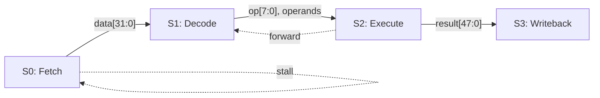

# Phase 3 μArch Design Policy

## Document Requirements (per-module docs/phase-3-uarch/*.md)

Each module document MUST contain:
1. **Module decomposition**: sub-modules with rationale (or single-module rationale)
2. **Clock domain assignment**: per sub-block, with synchronizer specs for cross-domain
3. **Protocol assignment**: per interface with justification (data rate, latency, backpressure)
4. **Design partitioning**: pipeline stages, resource sharing, parallelism degree
5. **Register/SRAM/FSM allocation**: pipeline regs, config regs, SRAM capacity+banking, FSM state count
6. **Inter/intra-module pipeline**: data flow, handshake, backpressure, hazard analysis
7. **Signal naming**: compliant with conventions below

## REQ→uArch Reverse Traceability

Every P3 run MUST produce `docs/phase-3-uarch/req-uarch-traceability.md` mapping each requirement
from `docs/phase-1-research/iron-requirements.json` (REQ-F-*, REQ-P-*) and
`docs/phase-2-architecture/iron-requirements.json` (REQ-A-*) to the uArch module(s) and section(s) implementing it.

Format:
```
| REQ ID   | uArch Module(s)         | Section(s)                  | Status   |
|----------|-------------------------|-----------------------------|----------|
| REQ-001  | intra_pred              | 3.2 Mode Decision FSM       | MAPPED   |
| REQ-002  | deblock_filter, sao     | 2.1 Pipeline, 4.3 SAO Ctrl  | MAPPED   |
| REQ-003  | —                       | —                           | UNMAPPED |
```

- **100% coverage required**: every REQ-NNN must appear. UNMAPPED REQs block the Phase 3 gate.
- **Staleness detection**: when P1 `requirements.json` changes after P3 completion, this table identifies which uArch sections need re-design. The P3 orchestrator uses mtime comparison to detect staleness.

## Clock Domain Assignment Rules

- Every sub-block MUST have an assigned clock domain
- Single-domain: `clk` / `rst_n`
- Multi-domain: `{domain}_clk` / `{domain}_rst_n` (e.g., `sys_clk`, `pixel_clk`)
- Cross-domain interfaces: explicit synchronizer type (2FF, handshake, async FIFO)
- Clock domain map: documented per module (which blocks share clocks, which cross)

## Protocol Assignment Rules

- Every inter-block interface MUST have an assigned protocol
- Supported protocols: valid/ready, AXI-Stream, FIFO, credit-based
- Protocol choice MUST be justified by data rate, latency, and backpressure requirements
- domain-consult invoked when protocol selection is non-obvious

## Storage Selection Criteria (Register vs SRAM Wrapper)

Every storage element in the μArch spec MUST include a storage type decision with rationale:

| Total Bits | Ports | Storage Type | Rationale |
|-----------|-------|-------------|-----------|
| ≤256 | any | **Flip-flop array** | SRAM macro overhead exceeds register cost at this size |
| 257–4096 | ≤2 R/W | **SRAM wrapper** (recommended) | Area-efficient; register file acceptable with documented rationale |
| 257–4096 | >2 R/W | **Register file** | Multi-port SRAM macros are rare; register file provides arbitrary port count |
| >4096 | ≤2 R/W | **SRAM wrapper** (mandatory) | Register file at this size wastes area and power |
| >4096 | >2 R/W | **Banked SRAM** or **register file** | Bank SRAM to reduce port count; register file only with PPA justification |

**Exceptions requiring register file regardless of size:**
- Reset to non-zero value (SRAM macros typically reset to unknown/zero only)
- Partial-word write with read-modify-write semantics not supported by target SRAM
- Content must survive clock gating (technology-dependent)

**SRAM wrapper interface specification** (required for every SRAM instance in μArch doc):
- Type: Single-port (SP) or Dual-port (DP)
- Parameters: `DEPTH`, `WIDTH` (derived `ADDR_W = $clog2(DEPTH)`)
- Read latency: 1 cycle (registered output) — default; document if different
- SP ports: `clk`, `i_ce`, `i_we`, `i_addr`, `i_wdata`, `o_rdata`
- DP ports (simple dual-port: 1W+1R): `clk`, `i_we`, `i_waddr`, `i_wdata`, `i_re`, `i_raddr`, `o_rdata`
- TDP ports (true dual-port: 2 R/W): `clk`, `i_ce_a`, `i_we_a`, `i_addr_a`, `i_wdata_a`, `o_rdata_a`, `i_ce_b`, `i_we_b`, `i_addr_b`, `i_wdata_b`, `o_rdata_b`
- Banking strategy: if capacity > single macro limit, specify bank count and address decode

## BFM Validation Requirements (MANDATORY)

Three sub-gates, applied in order (G4a → G4b → G4c):

- **(G4a) Compilation gate**: BFM must compile without errors before any further validation
- **Default**: blocking transport (LT — Loosely Timed) for fast simulation
- **On request**: non-blocking transport (AT — Approximately Timed) for timing accuracy
- **(G4b) Functional correctness gate**: BFM per-block output MUST be compared against Phase 2 C reference model (refc/) output using **shared test vectors** (same input to both models). Comparison must verify **data correctness** (functional output match), not just structural checks (file existence + compilation). FAIL on any per-block output mismatch.
  - If external golden C model is provided (e.g., JM/HM, vendor model): both refc and BFM must match it
  - If no external golden: BFM must match refc (Phase 2 is the golden reference)
  - BFM that compiles but produces wrong output → FAIL (worse than no BFM — false confidence)
  - On mismatch: run refc self-test first to determine root cause (refc bug vs BFM bug)
- **(G4c) I/O log existence gate**: per-block I/O logging MANDATORY — every block input/output transaction logged
  - Format: timestamped records (cycle, address, data, control signals)
  - Logs serve as golden reference for Phase 4-5 RTL unit verification
  - Log count must match block count from uArch docs
- If any gate fails: iterate uarch-designer ↔ bfm-dev ↔ ref-model-dev (max 2 iterations before escalation)

## Conditional Expert Delegation (Phase 3)

- **Invoke rtl-planner** when execution risk is the blocker rather than local RTL details:
  - Module/interface dependency chain is unclear for 5+ blocks
  - BFM and μArch revisions bounce for 2+ cycles with no convergence
  - Critical path or parallelization order is uncertain before Round 2 review
- **Expected rtl-planner output**: explicit task dependency graph, critical path, and
  parallel work groups that the orchestrator can apply to Step 3/5 sequencing.

- **Invoke clock-architect** when clocking strategy is non-trivial:
  - Multiple independent clock roots, generated clocks, PLL/MMCM, or clock muxing
  - Hierarchical clock gating strategy is proposed (ICG depth/placement decisions)
  - timing-advisor or cdc-checker repeatedly flags clock relationship feasibility risks
- **Expected clock-architect output**: review report at
  `reviews/phase-3-uarch/clock-architecture-review.md` and concrete fixes to
  `docs/phase-3-uarch/clock-domain-map.md`.

## Signal Naming Conventions (MANDATORY — flow to RTL)

- Inputs: `i_` prefix (NOT `_i` suffix)
- Outputs: `o_` prefix (NOT `_o` suffix)
- Bidirectional: `io_` prefix
- Clocks: `clk` (single) or `{domain}_clk` — NOT `clk_i`
- Resets: `rst_n` (single) or `{domain}_rst_n` — NOT `rst_ni`
- Instances: `u_` prefix (e.g., `u_fifo`)
- Generates: `gen_` prefix
- FSM states: `typedef enum logic [N:0]` with `UPPER_SNAKE_CASE` values
- Types: `snake_case_t` suffix (e.g., `state_t`, `bus_req_t`)
- Parameters: `UPPER_SNAKE_CASE` (e.g., `DATA_WIDTH`)
- Use `logic` only (no `reg`/`wire`)

## 3-Round Review Protocol (5 parallel reviewers)

Mandatory 3 rounds, coordinated by rtl-architect:
- **4 mandatory + 1 conditional parallel reviewers each round**:
  1. rtl-architect: feature preservation, block boundary, interface, protocol consistency
  2. timing-advisor: critical paths at target frequency, pipeline balance, clock domain feasibility
  3. (conditional) domain architecture expert: algorithm/memory/interface optimization
     — invoke when `domain-packages/{domain}/` exists (e.g., vcodec-architecture-expert for video codec).
     When no domain expert available, rtl-architect covers algorithm consistency in its scope.
  4. ref-model-dev: model consistency (behavior, data widths, fixed-point, I/O log alignment)
  5. bfm-dev: BFM simulation results, I/O logging correctness, protocol behavior

- Round 1-2: review → rebuttal (designer accepts/rejects each finding with rationale) → tree exploration for accepted issues → targeted revision (rejections recorded in per-round artifact)
- Last round (converged or max reached): cross-module interface audit, clock domain map consistency,
  memory conflict analysis, model consistency matrix, BFM final pass, μArch code review
- Convergence check after round >= min_rounds: finding_delta < 0.1, all critical resolved, wonder stable
- After max_rounds if not converged → escalate to user via AskUserQuestion
- Conditional reviewers:
  - clock-architect: multi-clock/generated-clock/gating risk present
  - rtl-planner: schedule/dependency risk dominates convergence delays

### Feature Preservation Checklist Format

Save to `reviews/phase-3-uarch/feature-preservation.md`:
```
# Phase 3 Review: Feature Preservation
- Date: YYYY-MM-DD
- Reviewer: rtl-architect
- Upper Spec: architecture.md
- Verdict: PASS | FAIL

## Feature Coverage Checklist
| Feature | Architecture Block | μArch Doc | Status |

## Findings
### [severity] Finding-N: ...

## Verdict
PASS | FAIL: [reason]
```

## Wonder Log (Required)

Each review round MUST produce a wonder-log entry:
- File: `docs/phase-3-uarch/wonder-log.md`
- Format: Markdown table with columns: Round, Assumption, Domain, Risk(H/M/L), Resolution
- Purpose: Track unvalidated assumptions across rounds
- Exit gate: All High-risk assumptions must be resolved or explicitly accepted before phase completion

## Review Convergence Criteria

Review rounds use dynamic convergence instead of fixed 3 rounds:

| Parameter | Value | Rationale |
|-----------|-------|-----------|
| min_rounds | 2 | Minimum for meaningful review |
| max_rounds | 5 | Prevent infinite loops |
| finding_delta_threshold | 0.1 | < 10% new findings = stable |
| critical_resolution | ALL | All Critical/High must be resolved |
| wonder_stability | true | No new High-risk assumptions |

**Early exit** (round 2): When findings converge quickly (simple designs)
**Extended review** (rounds 4-5): For complex designs with emergent issues

This is inspired by Ouroboros's ConvergenceCriteria:
- Stability signal: finding_delta < threshold
- Stagnation detection: same findings repeated across rounds
- Oscillation detection: finding toggling resolved↔reopened

## Escalation & Stop Conditions

- Timing infeasibility → report to user, propose alternative frequency or architecture change
- FSM cannot represent algorithm state → escalate to p2-arch-design
- Block boundary violation (merge/split not in architecture.md) → escalate to Phase 2
- Functional responsibility missing → uarch-designer adds or escalate if architecture change needed
- Clock domain crossing infeasible → escalate to p2-arch-design
- Protocol deadlock in BFM → iterate; if architectural cause, escalate to Phase 2
- BFM simulation fails after 2 iterations → escalate to user with root cause
- Per-block I/O logging incomplete → block Phase 3 completion

## Final Checklist

**Module decomposition & structure:**
- [ ] docs/phase-3-uarch/*.md exists for each block in architecture.md
- [ ] Module decomposition documented for every block
- [ ] Inter/intra-module pipelines defined
- [ ] **Throughput invariant verified**: every pipeline depth decision documents `rate_per_cycle × clock_freq ≥ target_throughput`. Pipeline changes that reduce net throughput below target are rejected.
- [ ] All block boundaries preserved (no unauthorized merges/splits)
- [ ] All functional responsibilities present

**Clock domain assignment:**
- [ ] Every sub-block has assigned clock domain
- [ ] Cross-domain interfaces specify synchronizer type
- [ ] docs/phase-3-uarch/clock-domain-map.md saved

**Protocol assignment:**
- [ ] Every inter-block interface has assigned protocol with justification
- [ ] docs/phase-3-uarch/protocol-assignments.md saved
- [ ] domain-consult invoked for protocol guidance

**Register/SRAM/FSM allocation:**
- [ ] Pipeline registers: placement justified
- [ ] Config registers: fields, widths, reset values defined
- [ ] Every storage element has explicit type decision (register vs SRAM wrapper) with rationale per Storage Selection Criteria
- [ ] SRAM instances: capacity, banking, port count, SP/DP type, read latency documented
- [ ] SRAM wrapper interface specified: DEPTH, WIDTH, port list, banking strategy (if banked)
- [ ] FSM: state count, encoding, transitions per control path

**BFM validation:**
- [ ] TLM-based BFM built and compiled (blocking LT)
- [ ] (G4b) BFM per-block functional output compared against Phase 2 C ref model (refc/) — bitexact or within documented tolerance
- [ ] If external golden C model provided: both refc and BFM match it
- [ ] Per-block I/O logging for ALL blocks
- [ ] I/O logs archived for Phase 4-5 use
- [ ] No deadlocks or protocol violations

**Review & compliance:**
- [ ] Dynamic convergence review completed (min 2 rounds, or gaps escalated and approved)
- [ ] Cross-module interfaces reviewed
- [ ] μArch ↔ ref model consistency verified
- [ ] Naming conventions enforced (i_/o_, {domain}_clk, u_, logic only)
- [ ] rtl-architect verdict PASS
- [ ] timing-advisor no blockers
- [ ] Domain architecture expert approved (when applicable)

**Rebuttal & per-round artifacts:**
- [ ] reviews/phase-3-uarch/uarch-review-r1.md with rebuttal section (accept/reject + rationale)
- [ ] reviews/phase-3-uarch/uarch-review-r2.md with rebuttal section (accept/reject + rationale)
- [ ] Additional round artifacts (r3-r5) if convergence required more rounds

## Open Resolution Protocol

Phase 3 receives `docs/phase-2-architecture/open-requirements.json` containing OPEN-2-* research topics.
For each OPEN-2-* item, the μArch team must:

1. Conduct μArch analysis using the item's `candidates` and `evaluation_criteria`
2. Select a winner with quantitative justification
3. Record the decision in `docs/phase-3-uarch/iron-requirements.json` (REQ-U-*) with:
   - `resolved_from`: the OPEN-2-* ID that was resolved
   - `resolution_rationale`: why this candidate was selected
   - `rejected_alternatives`: all non-selected candidates with rejection reasons
   - `upstream_compliance`: verification that new REQ-U-* does not violate P1+P2 iron
   - `violation_policy`: `"agent_retry"` (authority=3)
   - `acceptance_criteria`: measurable criteria for the μArch decision
4. Verify: ALL OPEN-2-* items must be resolved before Phase 3 exit

## iron-requirements.json Schema — acceptance_criteria

Each REQ-U-* entry SHOULD include structured acceptance_criteria:

```json
"acceptance_criteria": [
  {
    "ac_id": "REQ-U-NNN.AC-M",
    "description": "measurable criterion text",
    "test_method": "assertion|cocotb|formal|inspection",
    "verifiable": true
  }
]
```

Rules:
- Every REQ-U-* SHOULD have ≥1 acceptance criterion
- `ac_id` format: `{parent_req_id}.AC-{N}` (e.g., `REQ-U-012.AC-1`)
- `test_method` guides testbench-dev on verification approach:
  - `assertion`: protocol properties verifiable by SVA (e.g., valid stable during !ready)
  - `cocotb`: functional behavior verifiable by simulation (e.g., transfer completes correctly)
  - `formal`: invariants provable by formal verification (e.g., no deadlock)
  - `inspection`: non-automatable criteria — set `verifiable: false`
- `verifiable: false` criteria are excluded from automated coverage tracking;
  documented in RTM as `NOT_VERIFIABLE`
- P3 exit gate: advisory WARNING if any REQ-U-* has no AC (not a hard-block)
- Empty array `[]` treated same as absent field (backward compatible)

## iron-requirements.json Schema — traces_to

Each REQ-U-* entry SHOULD include a `traces_to` field linking to upstream requirements:

```json
  "traces_to": ["REQ-F-NNN", "REQ-A-NNN"]   // Upstream requirements this REQ-U-* decomposes from
```

Rules:
- Every REQ-U-* SHOULD have ≥1 entry in `traces_to` linking to P1 REQ-F-* or P2 REQ-A-*
- Enables cross-phase decomposition completeness verification
- P3 exit gate: advisory WARNING if Critical/High REQ-F-* has no REQ-U-* tracing to it

### Zero-Opens Invariant

Phase 3 MUST NOT produce an open-requirements.json. All research topics must be resolved here.
If unresolved items remain at Phase 3 exit → EXIT GATE FAIL.
P4 (Implementation) requires all requirements to be iron — no open items may remain.

## Compliance Check Procedure

After `docs/phase-3-uarch/iron-requirements.json` (REQ-U-*) is finalized:

1. Invoke compliance-checker agent with:
   - `upstream_iron`: `["docs/phase-1-research/iron-requirements.json", "docs/phase-2-architecture/iron-requirements.json"]`
   - `target_artifacts`: Phase 3 output artifacts
2. Gate: compliance-report.json verdict must be PASS
3. On VIOLATION: enter authority-differentiated escalation ladder
   - Authority 1 (P1 functional): Primary 3 + Fallback 2 + Last-chance 1
   - Authority 2 (P2 architecture): Primary 4 + Fallback 3 + Last-chance 1
   - Authority 3 (P3 μArch): Existing ladder N=5, Primary 5 + Fallback 5 + Last-chance 1

## Upstream Challenge Protocol

Same as Phase 2, but challenges may target P1 or P2 iron requirements.
Challenge report must identify which upstream authority is being challenged.
PPA estimates required with mandatory fields: frequency_mhz, area_gate_count, pixel_rate_mpps, achievable_fps.

## Ambiguity Gate (Phase 3)

Apply ambiguity scoring to all new REQ-U-* decisions:
- "Would re-analyzing this micro-architecture produce the same design?"
- Score ≤ 0.5 required before REQ-U-* becomes iron

**Artifacts saved:**
- [ ] reviews/phase-3-uarch/feature-preservation.md
- [ ] reviews/phase-3-uarch/uarch-review.md (consolidated)
- [ ] reviews/phase-3-uarch/pipeline-diagram.md (Mermaid — see format below)
- [ ] docs/phase-3-uarch/clock-domain-map.md
- [ ] docs/phase-3-uarch/protocol-assignments.md
- [ ] docs/phase-3-uarch/phase-3-summary.md
- [ ] docs/phase-3-uarch/req-uarch-traceability.md (100% REQ coverage)
- [ ] docs/decisions/ADR-*.md generated (3-5 key μArch decisions)
- [ ] `docs/phase-3-uarch/wonder-log.md` exists with per-round assumption tracking
- [ ] All High-risk assumptions in wonder-log resolved or explicitly accepted
- [ ] `docs/phase-3-uarch/upstream-feedback-report.md` generated (P1/P2 gap analysis)
- [ ] `docs/phase-3-uarch/requirement-delta.md` generated (REQ implementability scan)
- [ ] Per-round review artifacts saved (r1.md through rN.md, minimum 2 rounds)

- [ ] All OPEN-2-* items from P2 resolved with rationale and rejected_alternatives
- [ ] Zero remaining open items (P4 entry invariant — no open-requirements.json produced)
- [ ] `docs/phase-3-uarch/iron-requirements.json` exists with REQ-U-* entries and resolved_from tracking
- [ ] Compliance check against P1+P2 iron: verdict = PASS
- [ ] Ambiguity score ≤ 0.5 for all new REQ-U-* requirements

## Mermaid Pipeline Diagram Format

Per diagram policy: use Mermaid for pipeline/flow diagrams (ASCII art prohibited).



Each stage node: `SN[SN: stage_name]`. Edges: data width annotation.
Stall/forward paths: dashed arrows (`-.->`).
